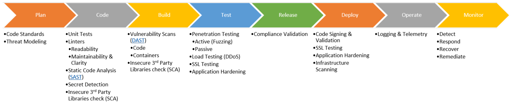

# DevSecOps Concepts

## Introduction

The DevSecOps practices are built on the adoption of DevOps culture. To familiarize yourself on the DevOps culture and understanding why it is important, check out the below links on the Microsoft journey of adopting DevOps culture.

1) [DevOps at Microsoft](https://docs.microsoft.com/en-us/azure/devops/learn/devops-at-microsoft/): Why DevOps shift is needed and how Microsoft approached the journey.
1) [Moving to Cloud Cadence](https://docs.microsoft.com/en-us/azure/devops/learn/devops-at-microsoft/moving-cloud-cadence): The cultural and organizational changes Azure DevOps team made to transform and adopt DevOps. Their journey to go from multi-year release cycle to multiple incremental releases per year.
1) [Evolving Test Practices at Microsoft](https://docs.microsoft.com/en-us/azure/devops/learn/devops-at-microsoft/evolving-test-practices-microsoft) and [Shift Left to Make Testing Fast and Reliable](https://docs.microsoft.com/en-us/azure/devops/learn/devops-at-microsoft/shift-left-make-testing-fast-reliable): These are focused on evolving the software engineer role to be responsible for quality of the feature and encouraging Test Driven Development. The cost of remediating bugs found in production are exponentially higher compared to bugs found in development. The same shift-left concept applies to DevSecOps as security vulnerabilities are bugs. As such identifying vulnerabilities sooner in the development cycle will make remediation easier and cheaper.
1) [Shift Right to Test in Production](https://docs.microsoft.com/en-us/azure/devops/learn/devops-at-microsoft/shift-right-test-production): Testing strategies in production. There is no place like production!
1) [Security in DevOps](https://docs.microsoft.com/en-us/azure/devops/learn/devops-at-microsoft/security-in-devops): “The Mindset Shift to a DevSecOps culture included an important thinking about not only preventing breaches, but assuming breaches as well.”

## DevSecOps Activities

In the below diagram are listed some of the DevSecOps activities as related to the DevOps process. For readability, the DevOps stages are depicted in a flat flow, however in reality, the Monitor stage provides feedback into the Plan stage for new threats detected.

The "Shift-Left" concept in DevSecOps is the investment in activities early in the DevOps process. The goal is to identify security vulnerabilities and identify them early to minimize cost and exposure.
